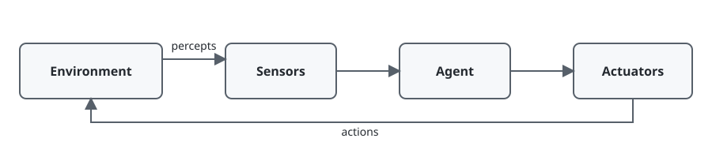
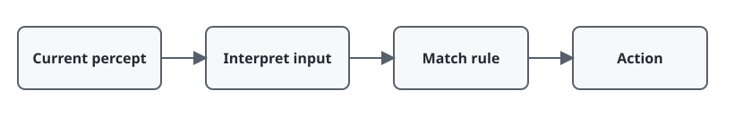

# Chapter 2 — Intelligent Agents

**Course:** CAI 4002 — Introduction to Artificial Intelligence (USF Fall 2026)
**Sections:** 2.1 Agents and Environments (pp. 54–56) · 2.3 Properties of Task Environments (pp. 60–65) · 2.4.2 Simple Reflex Agents (pp. 67–69).

## 1. Agents and Environments

> **Definition (Agent).** An entity that perceives its environment through **sensors** and acts on it through **actuators**.

| Agent | Sensors | Actuators |
|---|---|---|
| Human | eyes, ears, other organs | hands, legs, voice |
| Robot | cameras, range sensors | motors |
| Software | files, packets, user input | files, packets, displays, audio |

> **Definition (Percept).** The sensor input received at one moment.
>
> **Definition (Percept sequence).** The complete history of an agent's percepts.

An action may depend on built-in knowledge and the percept sequence, but not on information the agent has never perceived.

## 2. Agent Function and Program

> **Definition (Agent function).** An abstract mapping from percept sequences to actions.
>
> **Definition (Agent program).** The concrete implementation of that function on a physical architecture.

| Agent function | Agent program |
|---|---|
| Describes **what** the agent does | Describes **how** it computes actions |
| External behavior | Internal implementation |
| Conceptually an enormous table | Finite code |

## 3. Task-Environment Properties

The environment's properties determine which agent design is appropriate.

| Dimension | First case | Second case |
|---|---|---|
| **Observability** | fully observable: all action-relevant state is available | partially observable: state is hidden or sensors are noisy |
| **Agents** | single-agent: only one decision maker matters | multiagent: other rational agents affect outcomes |
| **Transitions** | deterministic: current state and action fix the next state | nondeterministic: several next states are possible |
| **Representation** | discrete: distinct states, percepts, or actions | continuous: values vary smoothly |

**Stochastic** means probabilities are specified; **nondeterministic** may list possible outcomes without probabilities.

### Common Classifications

| Environment | Observable | Agents | Transitions | Representation |
|---|---|---|---|---|
| Crossword | Fully | Single | Deterministic | Discrete |
| Chess | Fully | Multi | Deterministic | Discrete |
| Poker | Partially | Multi | Stochastic | Discrete |
| Taxi driving | Partially | Multi | Stochastic | Continuous |

## 4. Simple Reflex Agents

> **Definition (Simple reflex agent).** An agent that chooses an action from the **current percept only**.

A simple reflex agent matches the interpreted percept against **condition-action rules**:

> **Condition-action rule.** *If condition, then action.*

For the two-square vacuum world:

| Current percept | Action |
|---|---|
| current square is dirty | Suck |
| clean at A | Right |
| clean at B | Left |

Simple reflex agents work only when the current percept contains enough information for the correct choice. Under partial observability they can loop or repeatedly make the wrong decision. Randomization may help escape loops, but an internal state is the more general solution.

## Quick Reference

| Term | Meaning |
|---|---|
| **Agent** | perceives through sensors and acts through actuators |
| **Percept** | current sensor input |
| **Percept sequence** | complete percept history |
| **Agent function** | percept-sequence-to-action mapping |
| **Agent program** | implementation of the agent function |
| **Fully observable** | all action-relevant state is available |
| **Partially observable** | relevant state is hidden or noisy |
| **Deterministic** | state and action determine one next state |
| **Stochastic** | outcomes have explicit probabilities |
| **Discrete / continuous** | distinct values / smoothly varying values |
| **Simple reflex agent** | acts only from the current percept |
| **Condition-action rule** | *if condition, then action* |
