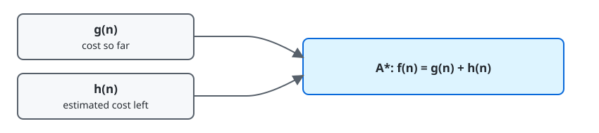

# Chapter 3 — Solving Problems by Searching

**Course:** CAI 4002 — Introduction to Artificial Intelligence (USF Fall 2026)
**Sections:** 3.1 Problem-Solving Agents (pp. 82–86) · 3.3–3.5 Search Algorithms (pp. 89–127).

## 1. Problem Solving

> **Definition (Search).** Finding an action sequence that leads from an initial state to a goal state.

A fixed action sequence is appropriate for a fully observable, deterministic, known environment. Uncertainty requires a conditional plan that responds to percepts.

### Search-Problem Components

| Component | Meaning |
|---|---|
| **State space** | all possible states |
| **Initial state** | starting state |
| **Goal test** | determines whether a state is a goal |
| $\text{ACTIONS}(s)$ | actions allowed in state $s$ |
| $\text{RESULT}(s,a)$ | state produced by action $a$ |
| $c(s,a,s')$ | action cost |

A **solution** is a path from the initial state to a goal. An **optimal solution** has minimum total path cost.

> **Definition (Abstraction).** Removing details that do not affect the solution. A useful abstraction keeps actions valid while making the problem easier to solve.

## 2. Search Structure

| Concept | Meaning |
|---|---|
| **State-space graph** | each state appears once; edges represent actions |
| **Search tree** | represents paths; one state may appear in several nodes |
| **Frontier** | generated but unexpanded nodes |
| **Reached set** | states already generated |
| **Expand** | generate a node's successors |

A search node stores its state, parent, generating action, and path cost $g(n)$. Reached-state tracking removes cycles and worse paths to the same state.

> **Definition (Best-first search).** Expand the frontier node with the smallest evaluation value $f(n)$.

Search algorithms differ mainly in how they order the frontier.

## 3. Evaluating Search Algorithms

| Criterion | Question |
|---|---|
| **Completeness** | Is a solution found whenever one exists? |
| **Cost optimality** | Is the lowest-cost solution found? |
| **Time complexity** | How many nodes are processed? |
| **Space complexity** | How many nodes are stored? |

Common symbols: $b$ = branching factor, $d$ = optimal solution depth, and $m$ = maximum path depth.

## 4. Uninformed Search

> **Definition (Uninformed search).** Search using no estimate of distance to a goal.

| Algorithm | Frontier rule | Complete? | Cost-optimal? | Time | Space |
|---|---|---:|---:|---:|---:|
| **BFS** | shallowest first; FIFO | Yes | Equal costs only | $O(b^d)$ | $O(b^d)$ |
| **DFS** | deepest first; stack | No in cyclic/infinite spaces | No | $O(b^m)$ | $O(bm)$ |
| **Iterative deepening** | repeated depth-limited DFS | Yes | Equal costs only | $O(b^d)$ | $O(bd)$ |
| **UCS** | lowest $g(n)$ first | Yes, with costs $\ge \epsilon > 0$ | Yes | exponential in $C^*/\epsilon$ | same as time |

- **BFS** finds the shallowest solution but consumes exponential memory.
- **DFS** uses little memory but can follow an infinite or cyclic path.
- **Iterative deepening** combines BFS's shallow-solution ordering with DFS's memory use.
- **Uniform-cost search (UCS)** expands the cheapest partial path and tests for a goal when dequeued, not when generated.

## 5. Informed Search

> **Definition (Heuristic).** $h(n)$ estimates the cheapest remaining cost from node $n$ to a goal.

| Algorithm | Evaluation function | Behavior |
|---|---|---|
| UCS | $f(n)=g(n)$ | considers cost already paid |
| Greedy best-first | $f(n)=h(n)$ | considers estimated cost remaining |
| A\* | $f(n)=g(n)+h(n)$ | balances both |

### A\* Search

A\* expands the frontier node with minimum

$$
f(n)=g(n)+h(n)
$$

A goal is accepted when **dequeued**. Merely generating a goal does not prove that a cheaper path is absent.

> **Definition (Admissible heuristic).** A heuristic that never overestimates the true remaining cost:

$$
0 \le h(n) \le h^*(n)
$$

With an admissible heuristic, A\* tree search is cost-optimal. A useful heuristic should be close to $h^*$ while remaining admissible; $h(n)=0$ reduces A\* to UCS.

> **Definition (Consistent heuristic).** For every successor $n'$ of $n$,

$$
h(n) \le c(n,n')+h(n')
$$

Consistency is the triangle inequality for heuristics. It implies admissibility and makes $f(n)$ nondecreasing along a path, allowing graph-search A\* to avoid reopening expanded states.

### Choosing Heuristics

A heuristic can be derived from a **relaxed problem** that removes constraints. The relaxed problem's optimal cost is a lower bound on the original cost.

> **Definition (Dominance).** Heuristic $h_a$ dominates $h_b$ when both are admissible and $h_a(n) \ge h_b(n)$ for every state. The dominating heuristic is at least as informed.

The combination

$$
h(n)=\max\bigl(h_1(n),h_2(n),\ldots,h_k(n)\bigr)
$$

preserves admissibility, and preserves consistency when every component heuristic is consistent.

### Weighted A\*

$$
f(n)=g(n)+W h(n)
$$

| Weight | Algorithm |
|---:|---|
| $W=0$ | UCS |
| $W=1$ | A\* |
| $1<W<\infty$ | Weighted A\* |
| $W\to\infty$ | Greedy best-first |

Larger $W$ emphasizes speed over optimality. Weighted A\* may expand fewer nodes but can return a suboptimal solution.

## Quick Reference

| Term | Meaning |
|---|---|
| **Search** | find an action sequence from start to goal |
| **Solution / optimal solution** | goal-reaching path / lowest-cost goal-reaching path |
| **Abstraction** | remove irrelevant detail from the model |
| **State-space graph / search tree** | unique states / path-based nodes that may repeat states |
| **Frontier / reached** | generated but unexpanded nodes / all generated states |
| **Best-first search** | expand the node with minimum $f(n)$ |
| **BFS** | shallowest first; complete; optimal for equal costs |
| **DFS** | deepest first; memory-efficient but incomplete and nonoptimal |
| **Iterative deepening** | repeated depth-limited DFS |
| **UCS** | minimum $g(n)$; complete and cost-optimal for positive costs |
| **Greedy best-first** | minimum $h(n)$; fast but not cost-optimal |
| **A\*** | minimum $g(n)+h(n)$ |
| **Admissible** | $h(n) \le h^*(n)$ |
| **Consistent** | $h(n) \le c(n,n')+h(n')$ |
| **Dominance** | larger admissible heuristic is more informed |
| **Weighted A\*** | $g(n)+Wh(n)$; trades optimality for speed when $W>1$ |
