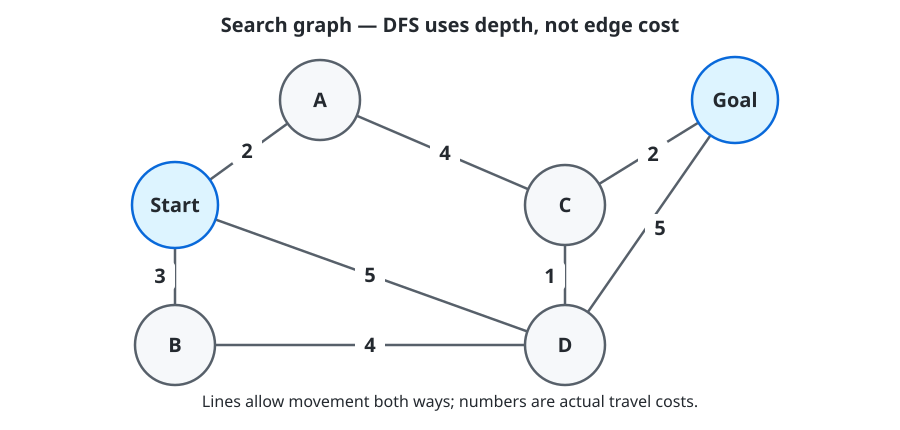
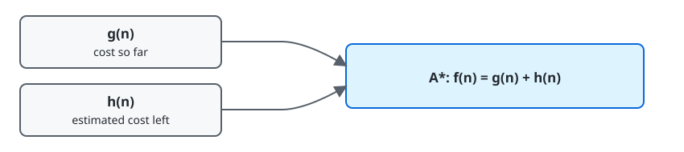

# Chapter 3 — Solving Problems by Searching

**Course:** CAI 4002 — Introduction to Artificial Intelligence (USF Fall 2026)
**Sections:** 3.1 Problem-Solving Agents (pp. 82–86) · 3.3–3.5 Search Algorithms (pp. 89–127).

## 1. Problem Solving

> **Definition (Search).** Finding an action sequence that leads from an initial state to a goal state.

A fixed action sequence is appropriate for a fully observable, deterministic, known environment. Uncertainty requires a conditional plan that responds to percepts.

### Search-Problem Components

| Component | Meaning |
|---|---|
| **State space** | all possible states |
| **Initial state** | starting state |
| **Goal test** | determines whether a state is a goal |
| $\text{ACTIONS}(s)$ | actions allowed in state $s$ |
| $\text{RESULT}(s,a)$ | state produced by action $a$ |
| $c(s,a,s')$ | action cost |

A **solution** is a path from the initial state to a goal. An **optimal solution** has minimum total path cost.

> **Definition (Abstraction).** Removing details that do not affect the solution. A useful abstraction keeps actions valid while making the problem easier to solve.

The **world state** contains every detail; the **search state** retains only what affects the task. For a maze with 120 positions, 30 food dots, two ghosts with 12 positions each, and four facings, a position-only pathfinding state space has 120 states. Eating all dots instead requires position and a 30-bit record of remaining food: $120\cdot 2^{30}$ states. The full world-state count also includes ghost positions and facing: $120\cdot 2^{30}\cdot 12^2\cdot 4$.

## 2. Search Structure

| Concept | Meaning |
|---|---|
| **State-space graph** | each state appears once; edges represent actions |
| **Search tree** | represents paths; one state may appear in several nodes |
| **Frontier** | generated but unexpanded nodes |
| **Reached set** | states already generated |
| **Expand** | generate a node's successors |

A search node stores its state, parent, generating action, and path cost $g(n)$. Reached-state tracking removes cycles and worse paths to the same state.

A cycle in the state graph can produce an infinite search tree: distinct action sequences may lead back to the same state. A closed set prevents repeated expansion only if discarding later paths to that state is safe for the chosen search rule.

> **Definition (Best-first search).** Expand the frontier node with the smallest evaluation value $f(n)$.

Search algorithms differ mainly in how they order the frontier.

## 3. Evaluating Search Algorithms

| Criterion | Question |
|---|---|
| **Completeness** | Is a solution found whenever one exists? |
| **Cost optimality** | Is the lowest-cost solution found? |
| **Time complexity** | How many nodes are processed? |
| **Space complexity** | How many nodes are stored? |

Common symbols: $b$ = branching factor, $d$ = optimal solution depth, and $m$ = maximum path depth.

## 4. Uninformed Search

> **Definition (Uninformed search).** Search using no estimate of distance to a goal.

| Algorithm | Frontier rule | Complete? | Cost-optimal? | Time | Space |
|---|---|---:|---:|---:|---:|
| **BFS** | shallowest first; FIFO | Yes | Equal costs only | $O(b^d)$ | $O(b^d)$ |
| **DFS** | deepest first; stack | No in cyclic/infinite spaces | No | $O(b^m)$ | $O(bm)$ |
| **Iterative deepening** | repeated depth-limited DFS | Yes | Equal costs only | $O(b^d)$ | $O(bd)$ |
| **UCS** | lowest $g(n)$ first | Yes, with costs $\ge \epsilon > 0$ | Yes | exponential in $C^{*}/\epsilon$ | same as time |

- **BFS** finds the shallowest solution but consumes exponential memory.
- **DFS** uses little memory but can follow an infinite or cyclic path.
- **Iterative deepening** combines BFS's shallow-solution ordering with DFS's memory use.
- **Uniform-cost search (UCS)** expands the cheapest partial path and tests for a goal when dequeued, not when generated.

### Worked Example — DFS and Backtracking

Example — Discussion 1, Q1(a): DFS expansion order and returned path

**Source:** CS 188, Fall 2026 Regular Discussion 1, Q1(a), p. 1 (`cs188-fa26-disc01.pdf`).

Find the DFS expansion order and returned path. Follow the deepest available branch, break ties alphabetically, and expand each state only once. For this trace, test for the goal when it is selected, not when first generated. Edge costs do **not** determine DFS order.

All connections allow movement in both directions:

| State | Neighbors and actual edge costs |
|---|---|
| Start | A (2), B (3), D (5) |
| A | Start (2), C (4) |
| B | Start (3), D (4) |
| C | A (4), D (1), Goal (2) |
| D | Start (5), B (4), C (1), Goal (5) |
| Goal | C (2), D (5) |

Solution

**Expansion order** records the states whose successors are processed. The **returned path** is the connected route from Start to Goal; it need not include every explored state.

| Step | State processed | Reasoning |
|---:|---|---|
| 1 | Start | Its neighbors are A, B, and D. Choose A alphabetically. |
| 2 | A | Skip already-expanded Start; continue deeper to C. |
| 3 | C | Skip A. Choose D before Goal alphabetically. |
| 4 | D | Skip Start and C. Choose B before Goal alphabetically. |
| 5 | B | Both neighbors, Start and D, are already expanded. This branch has no new state to explore. |
| 6 | Goal | Back up to D and explore its remaining neighbor, Goal. Stop successfully. |

- **Processing order, including Goal:** Start, A, C, D, B, Goal.
- **Strict expansion order:** Start, A, C, D, B. Goal is selected and passes the goal test, so its successors need not be expanded. If a worksheet includes Goal in its expansion-order convention, use the processing order above.
- **Returned path:** Start → A → C → D → Goal.

> **Why B does not trap the search.** B is a dead end for this search, not proof that Goal is unreachable. DFS backs up to the last branch point, D, and tries Goal. Expanding each state only once prevents processing D's neighbors all over again; it does not forbid backtracking to unfinished work.

Backing up to D is **not another expansion of D**. B was explored, but it is omitted from the returned path because it is not on the successful branch. In a stack implementation, unfinished branches remain waiting in the frontier; the algorithm need not physically move an agent backward.

## 5. Informed Search

> **Definition (Heuristic).** $h(n)$ estimates the cheapest remaining cost from node $n$ to a goal.

| Algorithm | Evaluation function | Behavior |
|---|---|---|
| UCS | $f(n)=g(n)$ | considers cost already paid |
| Greedy best-first | $f(n)=h(n)$ | considers estimated cost remaining |
| A\* | $f(n)=g(n)+h(n)$ | balances both |

### A\* Search

A\* expands the frontier node with minimum

$$
f(n)=g(n)+h(n)
$$

A goal is accepted when **dequeued**. Merely generating a goal does not prove that a cheaper path is absent.

> **Definition (Admissible heuristic).** A heuristic that never overestimates the true remaining cost:

$$
0 \le h(n) \le h^{*}(n)
$$

With an admissible heuristic, A\* tree search is cost-optimal. A useful heuristic should be close to $h^{*}$ while remaining admissible; $h(n)=0$ reduces A\* to UCS.

> **Definition (Consistent heuristic).** For every successor $n'$ of $n$,

$$
h(n) \le c(n,n')+h(n')
$$

Consistency is the triangle inequality for heuristics. It implies admissibility and makes $f(n)$ nondecreasing along a path, allowing graph-search A\* to avoid reopening expanded states.

An admissible but inconsistent heuristic can let A\* close a state reached at cost $g=3$ before discovering a path to that same state at cost $g=2$. A graph search that refuses to reopen it may miss the cheaper solution; consistency makes the first **dequeued** path to a state cheapest. Admissibility alone suffices for A\* tree search, not for this no-reopening policy.

### Worked Example — Admissible but Inconsistent

Example — Which heuristic is admissible but not consistent?

S is the start, G is the goal, and all arrows are directed. Edge costs are actual move costs; each heuristic estimates the remaining cost **from that state all the way to G**.

| Allowed move | Actual edge cost |
|---|---:|
| S → A | 2 |
| S → B | 5 |
| A → B | 1 |
| A → G | 6 |
| B → G | 3 |

Which option is **admissible for every state, but not consistent**? In every option, $h(G)=0$.

| Option | $h(S)$ | $h(A)$ | $h(B)$ |
|---|---:|---:|---:|
| **A** | 6 | 4 | 3 |
| **B** | 6 | 4 | 1 |
| **C** | 7 | 4 | 3 |
| **D** | 5 | 5 | 3 |

Solution

**1. Find each state's cheapest remaining cost.**

| State | Cheapest route to G | True remaining cost |
|---|---|---:|
| S | S → A → B → G | 2 + 1 + 3 = **6** |
| A | A → B → G | 1 + 3 = **4** |
| B | B → G | **3** |
| G | Already at the goal | **0** |

**2. Check admissibility: compare each estimate with that same state's true remaining cost.**

- **C fails:** $h(S)=7$ overestimates the true cost of 6.
- **D fails:** $h(A)=5$ overestimates the true cost of 4.
- **A and B both pass:** every estimate is no greater than the corresponding true cost. An underestimate is allowed; it does not have to equal the true cost.

**3. Check consistency: compare estimates across each directed edge.**

For A → B, the rule is $h(A) \le 1+h(B)$ because the move costs 1.

| Option | Estimate at A | Step cost + estimate at B | Does this edge pass? |
|---|---:|---:|---|
| **A** | 4 | 1 + 3 = 4 | Yes: $4 \le 4$ |
| **B** | 4 | 1 + 1 = 2 | No: $4 > 2$ |

All other edges pass for both options. **Option A is admissible and consistent; option B is admissible but inconsistent. The answer is B.**

> **Key distinction.** Admissibility checks each estimate against the actual cheapest remaining cost. Consistency checks how estimates change across every arrow: the estimate cannot drop by more than the cost of that move. One failing edge makes the entire heuristic inconsistent.

With $h(G)=0$, consistency implies admissibility, but admissibility does not imply consistency.

### Choosing Heuristics

A heuristic can be derived from a **relaxed problem** that removes constraints. The relaxed problem's optimal cost is a lower bound on the original cost.

On a four-direction grid with unit moves and no shortcuts, Manhattan distance ignores walls and is admissible; Euclidean distance also ignores walls but gives a smaller estimate. For a goal 10 columns and 5 rows away, they give $15$ and $\sqrt{125}\approx 11.18$, respectively. Manhattan dominates Euclidean under these movement assumptions.

> **Definition (Dominance).** Heuristic $h_a$ dominates $h_b$ when both are admissible and $h_a(n) \ge h_b(n)$ for every state. The dominating heuristic is at least as informed.

The combination

$$
h(n)=\max\bigl(h_1(n),h_2(n),\ldots,h_k(n)\bigr)
$$

preserves admissibility, and preserves consistency when every component heuristic is consistent.

### Weighted A\*

$$
f(n)=g(n)+W h(n)
$$

| Weight | Algorithm |
|---:|---|
| $W=0$ | UCS |
| $W=1$ | A\* |
| $1<W<\infty$ | Weighted A\* |
| $W\to\infty$ | Greedy best-first |

Larger $W$ emphasizes speed over optimality. Weighted A\* may expand fewer nodes but can return a suboptimal solution.

## Quick Reference

| Term | Meaning |
|---|---|
| **Search** | find an action sequence from start to goal |
| **Solution / optimal solution** | goal-reaching path / lowest-cost goal-reaching path |
| **Abstraction** | remove irrelevant detail from the model |
| **State-space graph / search tree** | unique states / path-based nodes that may repeat states |
| **Frontier / reached** | generated but unexpanded nodes / all generated states |
| **Best-first search** | expand the node with minimum $f(n)$ |
| **BFS** | shallowest first; complete; optimal for equal costs |
| **DFS** | deepest first; memory-efficient but incomplete and nonoptimal |
| **Iterative deepening** | repeated depth-limited DFS |
| **UCS** | minimum $g(n)$; complete and cost-optimal for positive costs |
| **Greedy best-first** | minimum $h(n)$; fast but not cost-optimal |
| **A\*** | minimum $g(n)+h(n)$ |
| **Admissible** | $h(n) \le h^{*}(n)$ |
| **Consistent** | $h(n) \le c(n,n')+h(n')$ |
| **Dominance** | larger admissible heuristic is more informed |
| **Weighted A\*** | $g(n)+Wh(n)$; trades optimality for speed when $W>1$ |
