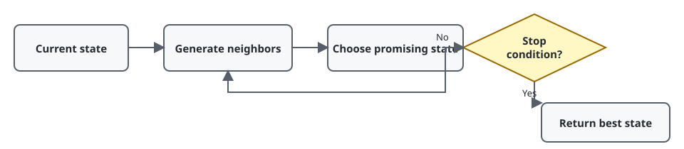
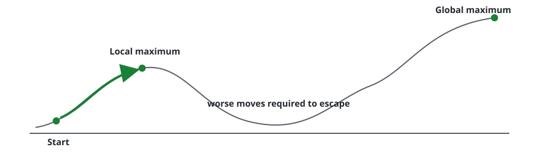
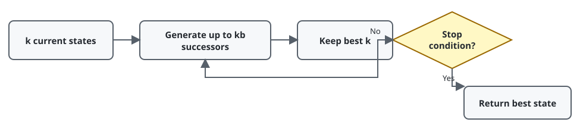

# Chapter 4 — Search in Complex Environments

**Course:** CAI 4002 — Introduction to Artificial Intelligence (USF Fall 2026)
**Sections:** 4.1 Local Search and Optimization Problems (pp. 128–136).

## 1. Local Search

> **Definition (Local search).** Search that moves from a current state to a neighboring state without storing paths or a reached set.

Use local search when the **final state matters but the path does not**, such as $n$-queens, scheduling, circuit layout, and parameter optimization.

| Strength | Limitation |
|---|---|
| Very low memory use | Not systematic |
| Handles large or infinite spaces | Usually incomplete |
| Often finds good solutions quickly | Usually not optimal |

> **Definition (Objective function).** A function assigning each state a value to maximize or a cost to minimize.

## 2. Hill Climbing

> **Definition (Hill climbing).** Repeatedly move to the highest-valued neighbor; stop when no neighbor improves the current state.

Hill climbing stores only the current state and performs no lookahead. It is also called **greedy local search**.

### State-Space Landscape

| Obstacle | Effect |
|---|---|
| **Local maximum** | Better than every neighbor, but worse than the global maximum |
| **Plateau** | Flat region with no clear direction |
| **Shoulder** | Flat region with an uphill exit |
| **Ridge** | Improvement requires moves not aligned with available steps |

### Variants

| Variant | Rule | Benefit |
|---|---|---|
| **Sideways moves** | Allow equal-valued moves, usually with a limit | May cross plateaus |
| **Stochastic** | Randomly choose among improving moves, weighted by value | Less sensitive to local optima |
| **First-choice** | Generate random successors until one improves | Useful with many successors |
| **Random restart** | Run hill climbing from multiple random states | Reduces dependence on the start state |

If one run succeeds with probability $p$, the expected number of runs is $1/p$.

## 3. Simulated Annealing

> **Definition (Simulated annealing).** A stochastic local search that always accepts improvements and sometimes accepts worse moves to escape local optima.

For a worse move with value change $\Delta E < 0$, acceptance probability is

$$
P(\text{accept}) = e^{\Delta E/T}
$$

High temperature $T$ allows exploration; lowering $T$ gradually makes the search increasingly greedy.

## 4. Local Beam Search

> **Definition (Local beam search).** Maintain $k$ states, generate their successors, and retain the best $k$ candidates.

- **Space:** $O(k)$ when successors are processed one at a time.
- **Time:** $O(mkb)$ for depth limit $m$ and branching factor $b$.
- **Guarantees:** generally neither complete nor optimal.
- **Main risk:** all $k$ states may cluster in one region.
- **Stochastic beam search:** samples successors by value instead of always taking the top $k$, preserving diversity.

## 5. Choosing a Local Search Method

| Situation | Good starting point |
|---|---|
| Cheap neighbors; smooth landscape | Hill climbing |
| Many successors | First-choice hill climbing |
| Strong dependence on initial state | Random restart |
| Many local optima | Simulated annealing |
| Enough memory for several candidates | Local beam search |

## Quick Reference

| Term | Meaning |
|---|---|
| **Local search** | explores neighbors without storing paths or reached states |
| **Objective function** | value to maximize or cost to minimize |
| **Hill climbing** | move to the best improving neighbor |
| **Local maximum** | locally best state that is not globally best |
| **Plateau / shoulder / ridge** | flat region / flat region with an exit / narrow difficult slope |
| **Random restart** | repeat local search from random initial states |
| **Simulated annealing** | sometimes accepts worse moves; randomness decreases with temperature |
| **Local beam search** | retain and expand the best $k$ states |
| $b$, $m$, $k$ | branching factor, maximum depth, beam size |
