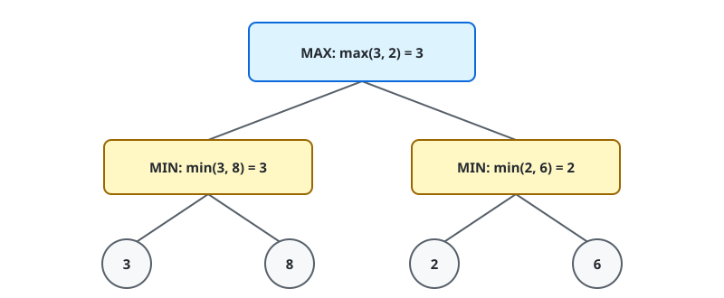

# Chapter 6 — Adversarial Search and Games

**Course:** CAI 4002 — Introduction to Artificial Intelligence (USF Fall 2026)
**Sections:** 6.1 Game Theory (pp. 192–193) · 6.2 Optimal Decisions in Games (pp. 194–196).

## 1. Adversarial Search

> **Definition (Adversarial search).** Search in a multiagent environment where agents have conflicting goals and actively choose actions against one another.

An opponent is not ordinary randomness: its actions are selected deliberately to improve its own outcome.

### Game Dimensions

| Dimension | Possibilities |
|---|---|
| Outcomes | Deterministic or stochastic |
| Players | One, two, or more |
| Information | Perfect or imperfect |
| Utilities | Zero-sum or general-sum |

The basic model assumes a **deterministic, two-player, turn-taking, perfect-information, zero-sum game**.

- **MAX** chooses actions that increase utility.
- **MIN** chooses actions that decrease MAX's utility.
- **Ply** means one move by one player.

## 2. Formal Game Model

A game is defined by:

| Component | Meaning |
|---|---|
| $S_0$ | initial state |
| $\text{TO-MOVE}(s)$ | player whose turn it is |
| $\text{ACTIONS}(s)$ | legal moves |
| $\text{RESULT}(s,a)$ | state after move $a$ |
| $\text{IS-TERMINAL}(s)$ | whether the game is over |
| $\text{UTILITY}(s,p)$ | terminal payoff for player $p$ |

> **Definition (Game tree).** A search tree containing possible move sequences; a complete game tree extends every sequence to a terminal state.

## 3. State Value

> **Definition (State value).** The best achievable utility from a state under the assumed decision model.

For a single agent:

$$
V(s) = \max_{s' \in \text{successors}(s)} V(s')
$$

With an adversary, the controlling player changes how values are backed up.

## 4. Minimax

> **Definition (Minimax value).** The utility MAX can guarantee from state $s$ when both players act optimally.

$$
\text{MINIMAX}(s) =
\begin{cases}
\text{UTILITY}(s, \mathrm{MAX}) & \text{if } s \text{ is terminal}, \\
\max\limits_{a \in \text{ACTIONS}(s)} \text{MINIMAX}(\text{RESULT}(s,a)) & \text{if MAX moves}, \\
\min\limits_{a \in \text{ACTIONS}(s)} \text{MINIMAX}(\text{RESULT}(s,a)) & \text{if MIN moves}.
\end{cases}
$$

### Value Backup Visual

MAX chooses the branch valued $3$; MIN would choose the lowest leaf within that branch.

### Procedure

1. Search depth-first to terminal states.
2. Assign terminal utilities.
3. At MIN nodes, back up the minimum child value.
4. At MAX nodes, back up the maximum child value.
5. Choose the root action with the highest backed-up value.

### Complexity

For branching factor $b$ and maximum depth $m$:

| Measure | Complexity |
|---|---|
| Time | $O(b^m)$ |
| Space, successors generated together | $O(bm)$ |
| Space, successors generated one at a time | $O(m)$ |

The exponential time cost makes full minimax impractical for large games; deeper methods use pruning or approximate leaf evaluation.

## 5. Why the Opponent Changes Planning

A single-agent plan chooses any reachable high-value leaf. A minimax strategy is a **conditional plan** that accounts for every opponent response. MAX cannot select a desirable terminal state directly; it selects a move whose worst optimal reply is best.

## Quick Reference

| Term | Meaning |
|---|---|
| **Adversarial search** | search against agents with conflicting goals |
| Perfect information | complete game state is observable |
| Zero-sum | one player's gain is the other's loss |
| MAX / MIN | maximize utility / minimize MAX's utility |
| **Ply** | one move by one player |
| **Terminal state** | state where the game has ended |
| **Utility** | numeric terminal payoff |
| **Game tree** | possible move sequences from a state |
| **Minimax value** | utility guaranteed under optimal play |
| **Minimax decision** | root move with highest backed-up value for MAX |
