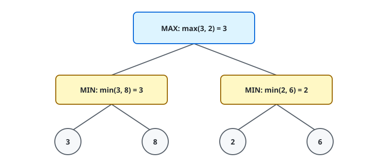

# Chapter 6 — Adversarial Search and Games

**Course:** CAI 4002 — Introduction to Artificial Intelligence (USF Fall 2026)
**Sections:** 6.1 Game Theory (pp. 192–193) · 6.2 Optimal Decisions in Games (pp. 194–201) · 6.3 Heuristic Alpha–Beta Tree Search (pp. 202–205) · 6.5 Stochastic Games (pp. 211–213).

## 1. Adversarial Search

> **Definition (Adversarial search).** Search in a multiagent environment where agents have conflicting goals and actively choose actions against one another.

An opponent is not ordinary randomness: its actions are selected deliberately to improve its own outcome.

### Game Dimensions

| Dimension | Possibilities |
|---|---|
| Outcomes | Deterministic or stochastic |
| Players | One, two, or more |
| Information | Perfect or imperfect |
| Utilities | Zero-sum or general-sum |

The basic model assumes a **deterministic, two-player, turn-taking, perfect-information, zero-sum game**.

- **MAX** chooses actions that increase utility.
- **MIN** chooses actions that decrease MAX's utility.
- **Ply** means one move by one player.

## 2. Formal Game Model

A game is defined by:

| Component | Meaning |
|---|---|
| $S_0$ | initial state |
| $\text{TO-MOVE}(s)$ | player whose turn it is |
| $\text{ACTIONS}(s)$ | legal moves |
| $\text{RESULT}(s,a)$ | state after move $a$ |
| $\text{IS-TERMINAL}(s)$ | whether the game is over |
| $\text{UTILITY}(s,p)$ | terminal payoff for player $p$ |

> **Definition (Game tree).** A search tree containing possible move sequences; a complete game tree extends every sequence to a terminal state.

## 3. State Value

> **Definition (State value).** The best achievable utility from a state under the assumed decision model.

For a single agent:

$$
V(s) = \max_{s' \in \text{successors}(s)} V(s')
$$

With an adversary, the controlling player changes how values are backed up.

## 4. Minimax

> **Definition (Minimax value).** The utility MAX can guarantee from state $s$ when both players act optimally.

$$
\text{MINIMAX}(s) =
\begin{cases}
\text{UTILITY}(s, \mathrm{MAX}) & \text{if } s \text{ is terminal}, \\
\max\limits_{a \in \text{ACTIONS}(s)} \text{MINIMAX}(\text{RESULT}(s,a)) & \text{if MAX moves}, \\
\min\limits_{a \in \text{ACTIONS}(s)} \text{MINIMAX}(\text{RESULT}(s,a)) & \text{if MIN moves}.
\end{cases}
$$

### Value Backup Visual

MAX chooses the branch valued $3$; MIN would choose the lowest leaf within that branch.

### Procedure

1. Search depth-first to terminal states.
2. Assign terminal utilities.
3. At MIN nodes, back up the minimum child value.
4. At MAX nodes, back up the maximum child value.
5. Choose the root action with the highest backed-up value.

### Complexity

For branching factor $b$ and maximum depth $m$:

| Measure | Complexity |
|---|---|
| Time | $O(b^m)$ |
| Space, successors generated together | $O(bm)$ |
| Space, successors generated one at a time | $O(m)$ |

The exponential time cost makes full minimax impractical for large games; deeper methods use pruning or approximate leaf evaluation.

## 5. Why the Opponent Changes Planning

A single-agent plan chooses any reachable high-value leaf. A minimax strategy is a **conditional plan** that accounts for every opponent response. MAX cannot select a desirable terminal state directly; it selects a move whose worst optimal reply is best.

## Day 4 — Multi-agent Search (Lecture)

### 6. Game Classes

Multi-agent search explicitly models other decision-makers rather than treating them as random parts of the environment. The game properties determine which search model is appropriate.

| Property | Distinction | Search consequence |
|---|---|---|
| Outcomes | deterministic or stochastic | stochastic games require chance nodes |
| Players | one, two, or more | more players need one utility value per player |
| Information | perfect or partial | partial information requires reasoning about hidden state |
| Utilities | zero-sum or general-sum | general-sum games can contain cooperation, competition, or both |

> **Definition (Zero-sum game).** A game in which one player's gain is the other player's loss; maximizing MAX's utility is equivalent to minimizing MIN's utility.

The core minimax setting is deterministic, two-player, turn-taking, perfect-information, and zero-sum. In a general-sum game, each terminal state needs a utility vector rather than one scalar. A player chooses the successor with the highest value for that player, so temporary alliances can arise even when every player acts in self-interest.

### 7. Alpha–Beta Pruning

> **Definition (Alpha–beta pruning).** A depth-first minimax optimization that skips a subtree once its value cannot affect the root's minimax decision.

$\alpha$ is MAX's best guaranteed value found so far along the current path; it is a lower bound. $\beta$ is MIN's best guaranteed value found so far; it is an upper bound.

| Node being expanded | Update | Cutoff condition |
|---|---|---|
| MAX | $\alpha = \max(\alpha, v)$ | $v \ge \beta$ |
| MIN | $\beta = \min(\beta, v)$ | $v \le \alpha$ |

At a MIN node, the running value can only decrease. If it reaches or falls below an ancestor MAX choice already worth $\alpha$, MAX will never choose this path, so the remaining children are irrelevant. The reasoning is symmetric at MAX nodes.

Alpha–beta returns the same minimax decision as exhaustive minimax, but a pruned interior node's returned value may be only a bound rather than its exact minimax value. To select an action, retain the best action found at the root instead of relying on a value-only routine.

Move ordering controls how much pruning occurs. Trying promising moves first produces earlier cutoffs. Minimax takes $O(b^m)$ time; with perfect ordering, alpha–beta examines $O(b^{m/2})$ nodes, effectively allowing roughly twice the search depth in the same time. Its depth-first space use remains $O(bm)$ when successors are generated together, or $O(m)$ when generated one at a time.

### 8. Depth-Limited Search and Evaluation Functions

Full game trees are usually too large to search to terminal states. A depth-limited alpha–beta search applies an evaluation function at a cutoff state instead of the terminal utility.

> **Definition (Evaluation function).** A fast estimate $\text{EVAL}(s,p)$ of the utility of state $s$ to player $p$.

For terminal states, evaluation must equal true utility. For nonterminal states, it should use the same outcome scale and rank positions in the same order as their true chances of winning. Unlike an admissible heuristic for A*, a game evaluation does not need to be nonnegative or a guaranteed underestimate; its goal is useful position ranking within a fixed search budget.

A common design is a weighted feature sum:

$$
\text{EVAL}(s) = \sum_{i=1}^{n} w_i f_i(s)
$$

Features can include material, mobility, king safety, or board control. The weights express their relative importance and can be learned from data. A cutoff test should always stop at terminal states and may stop at a depth limit; iterative deepening instead completes progressively deeper searches and returns the action from the deepest completed iteration.

Two cutoff pitfalls are important:

- **Quiescence:** Evaluate stable positions, not positions with an immediate tactical swing still pending. A quiescence search selectively extends tactical moves such as captures.
- **Horizon effect:** A player may delay an unavoidable loss until it lies beyond the depth limit, making a bad line appear favorable. Selective extensions can reduce this error but cannot remove all approximation error.

### 9. Expectimax and Stochastic Games

> **Definition (Chance node).** A game-tree node whose outgoing branches are random outcomes with known probabilities.

Expectimax replaces MIN nodes with chance nodes when uncertainty comes from sources such as dice rolls, action failures, an uncertain environment, or an imperfect opponent modeled probabilistically. MAX still selects its highest-valued action, while a chance node backs up an expected value:

$$
V(s) = \sum_{r} P(r) V(\text{RESULT}(s,r))
$$

**Expectiminimax** combines all three kinds of node: MAX takes a maximum, MIN takes a minimum, and CHANCE takes a probability-weighted average. It is appropriate for games such as backgammon, where player moves alternate with dice rolls.

Chance nodes make search much more expensive because every possible random outcome must be considered. For $n$ possible chance outcomes per event, exhaustive expectiminimax has time complexity $O(b^m n^m)$. Standard alpha–beta cutoffs do not transfer directly: a chance value depends on all branches. Pruning is possible only when known utility bounds and the remaining probability mass establish that the expected value cannot change the decision.

For stochastic games, evaluation values must represent expected utility or a positive linear transformation of win probability. Merely preserving the order of heuristic scores is not enough, because averaging depends on the numerical distances between values.

## Quick Reference

| Term | Meaning |
|---|---|
| **Adversarial search** | search against agents with conflicting goals |
| Perfect information | complete game state is observable |
| Zero-sum | one player's gain is the other's loss |
| MAX / MIN | maximize utility / minimize MAX's utility |
| **Ply** | one move by one player |
| **Terminal state** | state where the game has ended |
| **Utility** | numeric terminal payoff |
| **Game tree** | possible move sequences from a state |
| **Minimax value** | utility guaranteed under optimal play |
| **Minimax decision** | root move with highest backed-up value for MAX |
| **$\alpha$** | MAX's lower bound: best guaranteed value on the current path |
| **$\beta$** | MIN's upper bound: best guaranteed value on the current path |
| **Alpha–beta cutoff** | stop at MAX when $v \ge \beta$; stop at MIN when $v \le \alpha$ |
| **Evaluation function** | fast estimate of a nonterminal state's utility |
| **Quiescence search** | selective extension to reach tactically stable positions |
| **Horizon effect** | an inevitable event appears absent because it lies beyond the search depth |
| **Chance node** | node that averages successor values using outcome probabilities |
| **Expectimax** | MAX search with chance nodes and expected-value backup |
| **Expectiminimax** | game-tree search that combines MAX, MIN, and chance nodes |
