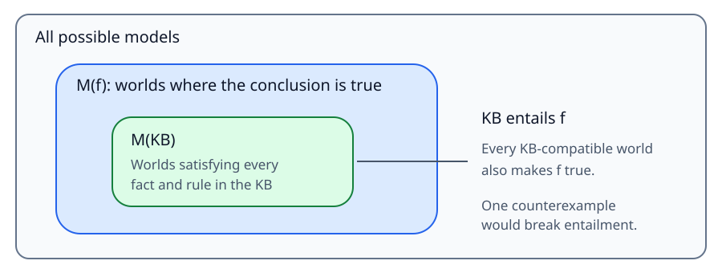

# Chapter 7 — Logical Agents

**Course:** CAI 4002 — Introduction to Artificial Intelligence (USF Fall 2026)
**Sections:** 7.1 Knowledge-Based Agents (pp. 227–228) · 7.4.1 Syntax (pp. 235–236) · 7.4.2 Semantics (pp. 236–238). Lecture support: 7.3 Logic (pp. 232–235) · 7.5 Propositional Theorem Proving and 7.5.1 Inference and Proofs (pp. 240–242).
**Class notes:** *Day 5 — Expectimax / Logical Reasoning*, slides 25–73. Adversarial-search material from slides 3–23 is in [Chapter 6](chapter-06-adversarial-search-and-games.md#day-5--expectimax-lecture).

## Section 7.1 — Knowledge-Based Agents

### 1. Knowledge and Inference

> **Definition (Knowledge base).** A knowledge base, or KB, is a set of sentences representing assertions about the world in a knowledge representation language.

> **Definition (Axiom).** A sentence accepted as given rather than derived from other sentences.

> **Definition (Inference).** Deriving new sentences from existing sentences. A justified answer must follow from the knowledge already supplied, not be invented.

| Operation | Purpose |
|---|---|
| **TELL** | add a sentence to the KB |
| **ASK** | query what follows from the KB, including which action to choose |

Both operations may involve inference. The KB can begin with background knowledge and grow as the agent receives percepts.

### 2. The Agent's Reasoning Cycle

1. **Record the percept:** TELL the KB what was observed at the current time.
2. **Choose an action:** ASK what action should be performed, using observations, background knowledge, and goals.
3. **Record the action:** TELL the KB which action was selected for execution.
4. **Execute and advance time:** return the action and update the time counter.

Time labels distinguish observations and actions at different moments. The interfaces translate percepts into sentences, goals into action queries, and selected actions into action sentences; TELL and ASK hide the inference machinery.

| Distinction | Meaning |
|---|---|
| **Knowledge level** | what the agent knows and wants to accomplish |
| **Implementation level** | how sentences are stored and reasoning is performed |
| **Declarative approach** | supply facts and rules, then let a reasoner determine behavior |
| **Procedural approach** | encode the desired behavior directly as program steps |

An agent can combine declarative and procedural elements. Learning can add general knowledge from experience rather than requiring the designer to supply every rule.

## Section 7.4.1 — Syntax

### 3. Propositions and Well-Formed Formulas

> **Definition (Proposition).** A declarative statement that can be true or false. Questions, greetings, and commands are not propositions.

> **Definition (Syntax).** The rules specifying which expressions are allowable sentences, or **well-formed formulas**, without determining their truth.

An **atomic sentence** is a single proposition symbol such as $P$, $Q$, $\text{FacingEast}$, or $W_{1,3}$. A subscripted name is still one indivisible symbol: propositional logic does not interpret its pieces. **True** and **False** have fixed meanings.

A **complex sentence** combines simpler sentences using parentheses and connectives. These rules are recursive: a connective's inputs can themselves be complex sentences.

| Connective | Name | Parts / terminology |
|---|---|---|
| $\neg P$ | negation, “not” | negated sentence |
| $P \land Q$ | conjunction, “and” | $P$ and $Q$ are conjuncts |
| $P \lor Q$ | disjunction, “or” | $P$ and $Q$ are disjuncts |
| $P \Rightarrow Q$ | implication, “if … then” | $P$ is the antecedent/premise; $Q$ is the consequent/conclusion |
| $P \Leftrightarrow Q$ | biconditional, “if and only if” | asserts both implication directions |

> **Definition (Literal).** An atomic sentence, called a positive literal, or its negation, called a negative literal.

$P$ and $\neg P$ are literals; $\neg(P \land Q)$ is not a literal because it negates a complex sentence.

### 4. Precedence and Valid Structure

From highest to lowest binding strength:

$$
\neg,\quad \land,\quad \lor,\quad \Rightarrow,\quad \Leftrightarrow
$$

Thus $\neg A \land B$ means $(\neg A) \land B$, not $\neg(A \land B)$. Use parentheses to make the intended grouping explicit.

| Expression | Well formed? | Reason |
|---|---|---|
| $\neg A$ | yes | negation of a sentence |
| $(\neg B \Rightarrow C) \lor A$ | yes | valid recursive combination |
| $A \lor \Rightarrow \lor A$ | no | binary connectives lack sentence operands |
| $A + B$ | no | addition is not a propositional connective |
| $A\neg B$ | no | no connective joins the two sentences |

Symbol names alone do not supply meaning. A formula can be syntactically valid without being true or useful.

## Section 7.4.2 — Semantics

### 5. Models and Truth Values

> **Definition (Semantics).** Rules determining whether a sentence is true or false in a particular model.

> **Definition (Propositional model).** An assignment of true or false to every relevant proposition symbol.

With $n$ independently assignable proposition symbols, there are $2^n$ possible models. Fixed constants True and False do not add independent choices.

To evaluate a complex formula, look up atomic truth values in the model, then evaluate its connectives from the inside outward. A model is a mathematical assignment; interpreting a symbol as a real-world claim is a separate step.

### 6. Truth Tables

| $P$ | $Q$ | $\neg P$ | $P \land Q$ | $P \lor Q$ | $P \Rightarrow Q$ | $P \Leftrightarrow Q$ |
|---|---|---|---|---|---|---|
| F | F | T | F | F | T | T |
| F | T | T | F | T | T | F |
| T | F | F | F | T | F | F |
| T | T | F | T | T | T | T |

- **NOT:** reverses the truth value.
- **AND:** true only when both inputs are true.
- **OR:** inclusive; true when at least one input is true, including when both are true. Exclusive OR would reject the both-true case.
- **Implication:** false only when the antecedent is true and the consequent is false.
- **Biconditional:** true when the two inputs have the same truth value.

### 7. Why Implication Can Be True with a False Antecedent

“If $P$, then $Q$” rules out just one case: $P$ occurs but $Q$ does not. If $P$ is false, the conditional has not been violated, regardless of $Q$. This is **vacuous truth**.

The lecture's lottery promise illustrates the idea: not winning the lottery does not break a promise to pay *if* you win.

$$
P \Rightarrow Q \equiv \neg P \lor Q
$$

Implication does **not** assert causation, relevance, or the reverse implication. A biconditional makes the stronger claim that both directions hold:

$$
P \Leftrightarrow Q \equiv (P \Rightarrow Q) \land (Q \Rightarrow P)
$$

The Wumpus rule “a square is breezy if and only if an adjacent square has a pit” uses this two-way relationship:

$$
B_{1,1} \Leftrightarrow (P_{1,2} \lor P_{2,1})
$$

## Day 5 — Logical Reasoning (Lecture)

### 8. From State-Based Search to Logic-Based Reasoning

| Model | Representation | Main question |
|---|---|---|
| **State-based** | states, actions, costs or utilities | which path or move is best? |
| **Logic-based** | facts, formulas, inference rules | what follows from what is known? |

Logic lets an agent combine information and reason about changed assumptions or rules. Its goals include representing knowledge, reasoning with it, and communicating it precisely.

Natural language can be ambiguous. In the lecture's “nothing is better than world peace” example, **nothing** means “no thing,” not an object that can be inserted into an ordinary ranking. Formal languages make the intended structure explicit rather than treating ambiguous English as a valid proof.

### 9. Equivalent Formulas and a Smaller Connective Set

> **Definition (Logical equivalence).** Two formulas are equivalent when they have the same truth value in every model, or equivalently, the same set of satisfying models.

$\equiv$ states an equivalence **between formulas**; $\Leftrightarrow$ is a connective **inside a formula**. Equivalent formulas can replace one another without changing meaning.

All five connectives can be expressed using only **NOT and OR**. Eliminate the biconditional and implication using the identities above, then eliminate AND:

$$
P \land Q \equiv \neg(\neg P \lor \neg Q)
$$

The lecture's standard equivalences are:

$$
\begin{aligned}
P \land Q &\equiv Q \land P &&\text{commutativity} \\
P \lor Q &\equiv Q \lor P \\
(P \land Q) \land R &\equiv P \land (Q \land R) &&\text{associativity} \\
(P \lor Q) \lor R &\equiv P \lor (Q \lor R) \\
\neg\neg P &\equiv P &&\text{double negation} \\
P \Rightarrow Q &\equiv \neg Q \Rightarrow \neg P &&\text{contraposition} \\
P \Rightarrow Q &\equiv \neg P \lor Q &&\text{implication elimination} \\
P \Leftrightarrow Q &\equiv (P \Rightarrow Q) \land (Q \Rightarrow P) &&\text{biconditional elimination} \\
\neg(P \land Q) &\equiv \neg P \lor \neg Q &&\text{De Morgan's laws} \\
\neg(P \lor Q) &\equiv \neg P \land \neg Q \\
P \land (Q \lor R) &\equiv (P \land Q) \lor (P \land R) &&\text{distributivity} \\
P \lor (Q \land R) &\equiv (P \lor Q) \land (P \lor R)
\end{aligned}
$$

### 10. Formulas as Sets of Models

> **Definition (Satisfaction).** A model satisfies a formula when the formula evaluates to true in that model.

Write $M(f)$ for the set of models satisfying formula $f$. A KB requires **every** sentence in it to be true, so its satisfying models are an intersection:

$$
M(\mathrm{KB}) = \bigcap_{f \in \mathrm{KB}} M(f)
$$

Each added fact or rule constrains which worlds remain possible. For $P \lor Q$, all assignments except the both-false assignment satisfy the formula. For $\mathrm{KB}=\lbrace P,Q \rbrace$, only the both-true assignment satisfies the KB.

> **Definition (Entailment).** A KB entails a formula when that formula is true in every model satisfying the KB.

$$
\mathrm{KB} \models f
\quad\text{if and only if}\quad
M(\mathrm{KB}) \subseteq M(f)
$$

**The subset direction matters:** all KB-compatible worlds must be inside the conclusion's model set. A formula being true in *one* compatible world is not enough. To disprove entailment, find one model where the KB is true and the proposed conclusion is false.

Failure to establish $f$ does not automatically establish $\neg f$; the available knowledge may leave both possibilities open.

### 11. Inference Rules and Forward Inference

> **Definition (Inference rule).** A pattern allowing a conclusion to be derived from matching premises. Rules operate on syntax; their justification comes from semantics.

| Rule | Required premises | Conclusion |
|---|---|---|
| **Modus ponens** | $P$, $P \Rightarrow Q$ | $Q$ |
| **Modus tollens** | $\neg Q$, $P \Rightarrow Q$ | $\neg P$ |
| **Hypothetical syllogism** | $P \Rightarrow Q$, $Q \Rightarrow R$ | $P \Rightarrow R$ |
| **Disjunctive syllogism** | $P \lor Q$, $\neg P$ | $Q$ |
| **Disjunctive addition** | $P$ | $P \lor Q$ |

A rule is truth-preserving if every model satisfying all premises also satisfies the conclusion. Truth tables can check this without assuming the propositions concern a particular topic.

**Forward inference:** repeatedly match rules against known formulas and add their conclusions. Continue until the target is derived or no new formulas are produced. Treat the KB as a set so rediscovering a formula does not count as progress. Exhaustive application can be costly; unrestricted rules can generate infinitely many distinct formulas, so reaching a fixed point is not guaranteed in general.

For the lecture's rain rules, knowing Rain and Rain implies Wet allows Wet to be added; knowing Wet implies Slippery then allows Slippery to be added. This is a chain of rule applications, not enumeration of every possible world.

### 12. Derivation, Soundness, and Completeness

> **Definition (Derivation).** A formula is derivable when the chosen inference procedure can produce it from the KB. Write $\mathrm{KB} \vdash_i f$ for derivation by procedure $i$.

| Notation | Meaning | Perspective |
|---|---|---|
| $\mathrm{KB} \models f$ | $f$ is true in every KB-compatible model | semantic relationship |
| $\mathrm{KB} \vdash_i f$ | procedure $i$ can prove $f$ from the KB | syntactic computation |

> **Definition (Soundness).** Everything the procedure derives is entailed: it produces no unjustified conclusions.

$$
\mathrm{KB} \vdash_i f \quad\Longrightarrow\quad \mathrm{KB} \models f
$$

> **Definition (Completeness).** Every entailed formula can be derived by the procedure: it misses no logical consequences.

$$
\mathrm{KB} \models f \quad\Longrightarrow\quad \mathrm{KB} \vdash_i f
$$

**Sound = nothing but the truth. Complete = the whole truth.** Together, derivability and entailment coincide. These guarantees concern what follows from the premises; sound reasoning cannot ensure real-world truth if the KB's premises are wrong.

Modus ponens is sound, but **modus ponens alone is not complete for unrestricted propositional logic**. In the lecture's KB containing Rain and “Rain OR Snow implies Wet,” Wet is entailed, but modus ponens cannot fire without the exact premise Rain OR Snow. Disjunctive addition would supply that missing premise. Completeness depends on the available rules and the language being considered.

“Backward modus ponens,” inferring $P$ from $Q$ and $P \Rightarrow Q$, is **unsound**. This is the fallacy of **affirming the consequent**: $P$ can be false while $Q$ and the implication are true. Wet ground, for instance, does not prove that it rained.

## Quick Reference

| Term / symbol | Meaning |
|---|---|
| **KB** | sentences representing facts and rules |
| **Axiom** | sentence accepted as given |
| **TELL / ASK** | add knowledge / query its consequences |
| **Declarative / procedural** | describe knowledge / encode behavior directly |
| **Syntax / semantics** | allowable structure / truth in a model |
| **Atomic sentence / literal** | one proposition symbol / an atom or its negation |
| **Model** | truth assignment to relevant proposition symbols |
| **$2^n$** | model count for $n$ independently assignable symbols |
| **$\neg$, $\land$, $\lor$** | NOT, AND, inclusive OR |
| **$P \Rightarrow Q$** | false only when $P$ is true and $Q$ false |
| **$P \Leftrightarrow Q$** | true when both sides have the same truth value |
| **$\equiv$** | formulas have identical truth values in every model |
| **$M(f)$** | models satisfying $f$ |
| **$M(\mathrm{KB})$** | intersection of all KB sentences' model sets |
| **$\models$ / $\vdash_i$** | entails / derives using procedure $i$ |
| **Entailment test** | every KB model must satisfy the conclusion |
| **Modus ponens** | from $P$ and $P \Rightarrow Q$, infer $Q$ |
| **Soundness** | derivable implies entailed; no unjustified conclusions |
| **Completeness** | entailed implies derivable; no missed consequences |
| **Affirming the consequent** | invalid reverse use of an implication |
